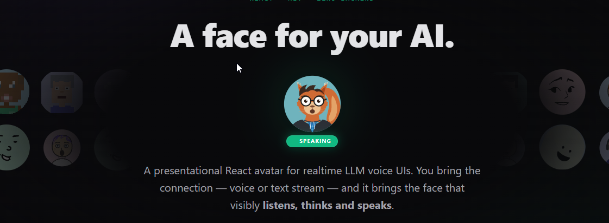

<p align="center">
  
</p>

<h1 align="center">react-ai-avatar</h1>

<p align="center">
  <strong>A face for your AI.</strong><br/>
  A presentational React avatar for realtime LLM voice &amp; text UIs — you bring the connection,<br/>
  it brings the face that visibly <strong>listens, thinks and speaks</strong>.
</p>

<p align="center">
  <a href="https://www.npmjs.com/package/react-ai-avatar"></a>
  <a href="https://www.npmjs.com/package/react-ai-avatar"></a>
  
  
  <a href="./LICENSE"></a>
</p>

<p align="center">
  <a href="https://www.npmjs.com/package/react-ai-avatar"><b>npm</b></a> &nbsp;·&nbsp;
  <a href="https://react-ai-avatar-site.vercel.app/#/docs"><b>Documentation</b></a> &nbsp;·&nbsp;
  <a href="https://react-ai-avatar-site.vercel.app/"><b>Live demos</b></a> &nbsp;·&nbsp;
  <a href="#quickstart"><b>Quickstart</b></a>
</p>

---

**react-ai-avatar** handles exactly one step of your voice/chat pipeline: turning audio amplitude and conversation-state changes into a face that visibly reacts. It is **completely LLM-agnostic** — it doesn't know about Gemini, OpenAI or ElevenLabs. You pass two live things — a `state` and (optionally) a WebAudio `AnalyserNode` — and it does the rest. Your host app keeps the microphone, the WebSocket and the AI provider; **none of those dependencies enter your bundle**. One thing, done well, embeddable in a few lines, no backend, MIT.

```tsx
import { RealtimeAvatar } from 'react-ai-avatar';
import 'react-ai-avatar/style.css';

// The whole thing, minimally. Everything but `state` has a sensible default.
<RealtimeAvatar state="speaking" />
```

<p align="center">
  
</p>

## Quickstart

```bash
npm install react-ai-avatar motion
```

`react`, `react-dom` and `motion` are peer dependencies. The only prop you *have* to pass is `state` — you resolve it in your app, the avatar never infers it:

```tsx
import { RealtimeAvatar } from 'react-ai-avatar';
import 'react-ai-avatar/style.css';

export default function App() {
  // You resolve this in your app (Gemini, OpenAI Realtime, WebRTC, anything)
  const aiState = 'speaking'; // 'idle' | 'listening' | 'thinking' | 'speaking' | 'working'

  return <RealtimeAvatar state={aiState} />;
}
```

With no `analyser`, `speaking` falls back to a synthetic speech-like mouth — great for getting something on screen before the audio pipeline exists. Pass an `AnalyserNode` to make the mouth react to real audio (see [Driving the mouth](#driving-the-mouth)). Every default is overridable:

```tsx
<RealtimeAvatar
  state={aiState}
  analyser={analyser}                 // AnalyserNode | null — real audio-reactive mouth
  size={300}                          // default 280
  variant="geometric"                 // 'geometric' | 'memoji' | 'pixelart' | 'doodle' | 'dicebear' | 'vrm' | 'glb' | 'byos'
  customization={{ skinColor: '#f5c7a9', hairColor: '#2c2c2c', glasses: true, headphones: true }}
  stateColors={{ idle: '#4b5563', listening: '#3b82f6', thinking: '#8b5cf6', speaking: '#10b981', working: '#f59e0b' }}
/>
```

For the optional 3D (VRM) variant, also install `three @react-three/fiber @react-three/drei @pixiv/three-vrm`; for `glb`, the same minus `@pixiv/three-vrm`; for `dicebear`, `@dicebear/core @dicebear/collection`. All are **optional** peer dependencies, lazy-loaded only if you use that variant.

## Table of contents

- [Philosophy](#philosophy)
- [Features](#features)
- [The avatar catalog](#the-avatar-catalog)
- [Driving the mouth](#driving-the-mouth)
  - [Audio: getting an `AnalyserNode`](#audio-getting-an-analysernode)
  - [Text-streaming LLMs (no audio)](#text-streaming-llms-no-audio)
- [Bring your own SVG (`byos`)](#bring-your-own-svg-byos)
- [3D avatars (VRM and GLB)](#3d-avatars-vrm-and-glb)
- [DiceBear avatars (`dicebear`)](#dicebear-avatars-dicebear)
- [API reference](#api-reference)
- [Building blocks](#building-blocks)
- [Positioning](#positioning)
- [Examples](#examples)
- [Contributing](#contributing)
- [License](#license)

## Philosophy

One thing, done well, embeddable in a few lines, no backend, MIT. The library handles exactly one step of your voice pipeline: turning audio amplitude + state changes into a face that visibly **listens, thinks and speaks**. Your host app keeps the microphone, the WebSocket and the AI provider — none of those dependencies enter your bundle.

## Features

- 👄 **Audio-reactive mouth** — analyzes amplitude and frequency bands in real time. This is deliberately *not* phoneme-perfect "lip-sync": an `AnalyserNode` gives energy, not phonemes, and for flat avatars amplitude is what looks right.
- 🦺 **Graceful degradation** — `analyser={null}` while `state="speaking"`? The mouth animates with a synthetic speech-like pattern instead of freezing. Perfect for demos and non-WebRTC apps.
- ⌨️ **Text-streaming LLMs too** — no audio? Drive the mouth from *token cadence* with `createSpeechActivity()`. A text-only assistant (OpenAI-style `/chat/completions` or `/responses` with `stream: true`) gets a face that visibly tracks the stream — busy while tokens arrive, settling on pauses.
- 🧠 **A visible `thinking` state** — pulsing thought bubble + upward gaze. Your users *see* the LLM thinking, not just a color change.
- 🛠️ **A `working` state for tool use** — the fifth state, for agentic UIs. While the LLM runs a tool, the face goes amber and the state pill reads `Working: {tool}` (pass the tool name via the `tool` prop). Your users see *which* tool is running, not just a spinner.
- 🎨 **Own-design avatar catalog** — `geometric`, `memoji`, `pixelart`, `doodle`: four MIT, CC0-safe SVG presets. No third-party assets, no attribution headaches.
- 🎲 **DiceBear avatars (`dicebear`)** — generate deterministic [DiceBear](https://www.dicebear.com) avatars client-side, from a curated **CC0-only** style set (still no attribution). Animated with an audio-reactive bounce.
- 🔌 **Bring your own SVG (`byos`)** — any SVG implementing the small layer contract gets the full animation runtime for free. Your avatar, your license.
- ♿ **Production quality** — SSR-safe (Next.js friendly), honors `prefers-reduced-motion`, announces state changes via `aria-live`.
- 🧊 **Optional 3D (VRM/GLB)** — `variant="vrm"` / `variant="glb"` render VRoid/VRM and ARKit-rigged glTF models with visemes and gaze tracking. The three.js stack is an *optional* peer dependency, lazy-loaded only if you use it.

## The avatar catalog

| variant | style | notes |
|---|---|---|
| `geometric` | minimal flat geometry | the default; canonical layer-contract example |
| `memoji` | soft volumetric head | radial gradients, glossy eyes, blush |
| `pixelart` | retro 32×32 grid | mouth and pupils move in whole pixels |
| `doodle` | hand-drawn ink sketch | wobbly strokes, sketched thought bubble |
| `dicebear` | [DiceBear](https://www.dicebear.com) styles | optional, lazy-loaded; curated CC0 set; pass `dicebearCollection` / `dicebearSeed` |
| `vrm` | 3D VRoid/VRM model | optional, lazy-loaded; pass `vrmUrl` |
| `glb` | 3D glTF + ARKit blendshapes | optional, lazy-loaded; pass `glbUrl`. Works with [Microsoft Rocketbox](https://github.com/microsoft/Microsoft-Rocketbox) (MIT), Ready Player Me, or any `.glb` exposing the 52 ARKit morph targets |
| `byos` | **your** SVG | pass it as children; see the layer contract |

All built-in presets are original designs licensed MIT — nothing inside this package requires attribution.

## Driving the mouth

The mouth has three possible drivers, in precedence order: an explicit `speechActivity` source, then `streamingText`, then the audio `analyser`. Pick whichever matches your pipeline — voice apps use the analyser, text-only LLMs use the streaming-text paths.

### Audio: getting an `AnalyserNode`

The standard recipe for base64 PCM streams (what Gemini Live / OpenAI Realtime return):

```ts
const audioCtx = new AudioContext({ sampleRate: 24000 });
const analyser = audioCtx.createAnalyser();
analyser.fftSize = 256;
analyser.connect(audioCtx.destination);

function playAudioChunk(pcmData: Float32Array) {
  const buffer = audioCtx.createBuffer(1, pcmData.length, 24000);
  buffer.getChannelData(0).set(pcmData);
  const source = audioCtx.createBufferSource();
  source.buffer = buffer;
  source.connect(analyser); // <- the analyser you pass to <RealtimeAvatar />
  source.start();
}
```

### Text-streaming LLMs (no audio)

Not every assistant speaks. For a text-only LLM that streams tokens — OpenAI-style `/chat/completions` or `/responses` with `stream: true`, or local servers like Ollama / LM Studio / vLLM — there's no `AnalyserNode` to read. Instead, drive the mouth from **token cadence**: the rhythm of arriving text becomes the same 0..1 energy signal the audio path produces. The mouth is busy while the model emits text and settles shut on pauses or when the stream ends. The library still never fetches anything — you own the stream, it owns the face.

There are two ways to feed it, matching the two ways React apps consume streams.

#### Declarative — `streamingText` (the easy path)

If you use a streaming chat hook — the [Vercel AI SDK](https://sdk.vercel.ai)'s `useChat` is the de-facto standard — you never see raw chunks: you get the **accumulated** assistant message (it grows each render) plus a `status`. Both map straight onto the avatar. Pass the text, the avatar diffs its growth internally and drives the mouth. No refs, no reader loop:

```tsx
import { useChat } from '@ai-sdk/react';
import { RealtimeAvatar } from 'react-ai-avatar';
import 'react-ai-avatar/style.css';

function ChatAvatar() {
  const { messages, status } = useChat();
  const last = messages.at(-1);

  return (
    <RealtimeAvatar
      // status: 'submitted' (awaiting first token) | 'streaming' | 'ready'
      state={status === 'submitted' ? 'thinking' : status === 'streaming' ? 'speaking' : 'idle'}
      streamingText={last?.role === 'assistant' ? last.text : ''}
    />
  );
}
```

That's the whole integration. `streamingText` takes precedence over `analyser`; the ambient glow reacts to it too. Works with every variant — flat presets, DiceBear, VRM and GLB.

#### Imperative — `createSpeechActivity()` (you own the reader loop)

Hand-rolling `fetch` or driving the OpenAI SDK's `for await` yourself? Then you *do* have the raw chunks — feed their cadence directly with a `SpeechActivitySource`:

```tsx
import { RealtimeAvatar, createSpeechActivity } from 'react-ai-avatar';
import 'react-ai-avatar/style.css';
import { useRef, useState } from 'react';

function TextAvatar() {
  const speech = useRef(createSpeechActivity()).current;
  const [state, setState] = useState<'idle' | 'thinking' | 'speaking'>('idle');
  const [subtitle, setSubtitle] = useState('');

  async function ask(prompt: string) {
    setState('thinking');
    speech.reset();
    const res = await fetch('/api/chat', {
      method: 'POST',
      headers: { 'Content-Type': 'application/json' },
      body: JSON.stringify({ messages: [{ role: 'user', content: prompt }] }),
    });
    const reader = res.body!.getReader();
    const decoder = new TextDecoder();
    let text = '';
    for (;;) {
      const { done, value } = await reader.read();
      if (done) break;
      const chunk = decoder.decode(value); // your SSE/delta parsing here
      text += chunk;
      speech.push(chunk);   // <- feed token cadence to the mouth
      setSubtitle(text);
      setState('speaking');
    }
    speech.end();
    setState('idle');
  }

  return <RealtimeAvatar state={state} speechActivity={speech} subtitle={subtitle} />;
}
```

`createSpeechActivity(options?)` accepts `chargePerChar`, `decayMs` and `maxChargePerPush` to tune how wide / how fast the mouth reacts. The returned source has `push(chunk)`, `end()`, `reset()` (drop energy on an interrupted turn) and `sample()`. When `speechActivity` is provided it takes precedence over both `streamingText` and `analyser`. (`streamingText` is just this, with the diffing done for you — under the hood it's the exported `useStreamingTextActivity` hook.)

> [`examples/03-streaming-text-imperative.tsx`](examples/03-streaming-text-imperative.tsx) shows this end-to-end against an OpenAI-compatible endpoint. The browser only ever talks to your own `/api/chat`; a tiny reference relay that proxies to the provider (so the key never reaches the client) lives in [`examples/server/proxy.ts`](examples/server/proxy.ts).

## Bring your own SVG (`byos`)

Any SVG exposing these stable hooks is animated by the runtime — same blink, gaze, mouth and thinking behavior as the built-in presets:

| hook | part | the runtime drives |
|---|---|---|
| `#rra-ring` | state ring | `stroke` = `stateColors[state]` |
| `#rra-mouth` | mouth | ellipse: `ry`/`rx` · rect: `height` |
| `.rra-pupil` (×2) | pupils | circle: `cx`/`cy` · rect: `x`/`y` (mouse tracking, thinking gaze) |
| `.rra-lid` (×2) | eyelids | `height` (blink; 0 = open) |
| `#rra-think` | thought bubble | `opacity` + dots pulsing while `thinking` |

Optional data attributes: `data-base-x`/`data-base-y` (pupil rest position), `data-max-height` (closed lid height), `data-quantize` (snap motion to a grid — that's how the pixel-art preset stays chunky).

```tsx
<RealtimeAvatar state={aiState} analyser={analyser} variant="byos">
  <MyOwnSvgAvatar /> {/* exposes the #rra-* hooks; its license is your business */}
</RealtimeAvatar>
```

## 3D avatars (VRM and GLB)

Both 3D variants share the same mouth engine as the flat presets, so the model talks, blinks and follows the cursor. The three.js stack is an **optional** peer dependency, lazy-loaded only when one of these variants renders — it never enters your bundle otherwise.

**`vrm`** — render VRoid/VRM models with visemes and gaze tracking:

```bash
npm install three @react-three/fiber @react-three/drei @pixiv/three-vrm
```

```tsx
<RealtimeAvatar state={aiState} analyser={analyser} variant="vrm" vrmUrl="/models/avatar.vrm" />
```

**`glb`** — render any `.glb` that exposes the **52 [ARKit blendshapes](https://arkit-face-blendshapes.com/)** (the standard `jawOpen`, `mouthFunnel`, `eyeBlinkLeft`, … morph targets). Same deal as `vrm`, minus `@pixiv/three-vrm`:

```bash
npm install three @react-three/fiber @react-three/drei
```

```tsx
<RealtimeAvatar state={aiState} analyser={analyser} variant="glb" glbUrl="/models/rocketbox.glb" />
```

**Recommended example asset — Microsoft Rocketbox (MIT).** [Rocketbox](https://github.com/microsoft/Microsoft-Rocketbox) ships 115 rigged avatars with an ARKit-compatible blendshape variant, under the **MIT license** — the cleanest fit for this library's no-attribution-headaches philosophy. Rocketbox distributes `.fbx`, so convert one avatar to `.glb` once (offline, via [FBX2GLTF](https://github.com/facebookincubator/FBX2glTF) or Blender's glTF 2.0 export, keeping the blendshapes) and drop it in `public/models/`. Keep the MIT notice alongside it. [Ready Player Me](https://docs.readyplayer.me/ready-player-me/api-reference/avatars/morph-targets/apple-arkit) avatars (`?morphTargets=ARKit`) also work out of the box.

## DiceBear avatars (`dicebear`)

Generate [DiceBear](https://www.dicebear.com) avatars client-side — deterministic per `seed`, no network call. The packages are **optional** peer dependencies, lazy-loaded only when this variant renders:

```bash
npm install @dicebear/core @dicebear/collection
```

```tsx
<RealtimeAvatar
  state={aiState}
  analyser={analyser}
  variant="dicebear"
  dicebearCollection="open-peeps" // curated CC0 style id
  dicebearSeed="ada-lovelace"     // same seed + style => same face
/>
```

**Licensing:** DiceBear ships ~30 styles under mixed licenses. This library's catalog (`DICEBEAR_STYLES`) is curated to **CC0 1.0** styles that have a face — `pixel-art`(+`-neutral`), `lorelei`(+`-neutral`), `notionists`(+`-neutral`), `open-peeps`, `thumbs` — so it keeps the same no-attribution promise as the built-in presets. You *can* pass any other DiceBear style id to `dicebearCollection`, but then its license (e.g. CC BY 4.0 for `adventurer`, or "free for personal and commercial use" for `bottts`) is your responsibility — same deal as `byos`.

**Animation:** DiceBear SVGs have no `#rra-*` hooks, but their *option API* lets us pick which mouth/eyes variant to render. So every curated style actually **talks**: it pre-generates a few frames of the same avatar (same seed ⇒ identical hair/skin/etc.) with closed / mid / open mouths — plus a blink frame where the style allows — and swaps which frame is shown per audio frame, with a subtle bounce on top. Real articulation via the supported API, no fragile path hacks. The per-style variant choices live in the exported `DICEBEAR_RIGS` map. (A non-rigged style id you pass yourself — e.g. a faceless abstract DiceBear style — falls back to a pure audio-reactive bounce.) State color and the thinking bubble still come from the surrounding `<RealtimeAvatar />` chrome.

## API reference

### `<RealtimeAvatar />`

- `state` (`'idle' | 'listening' | 'thinking' | 'speaking' | 'working'`) — required. You resolve it; it is never inferred. `working` is the tool-use state for agentic UIs (amber).
- `tool` (`string`) — optional. The name of the tool currently running. While `state="working"`, the state pill reads `Working: {tool}` instead of the generic label.
- `analyser` (`AnalyserNode | null`) — optional. Drives the mouth from audio. Omitted or `null`, speaking falls back to the synthetic pattern.
- `streamingText` (`string`) — optional. Declarative mouth driver: pass the accumulated assistant text (e.g. from `useChat`) and the avatar diffs its growth to drive the mouth. Takes precedence over `analyser`. See [Text-streaming LLMs](#text-streaming-llms-no-audio).
- `speechActivity` (`SpeechActivitySource`) — optional. Imperative token-rate mouth driver, from `createSpeechActivity()`. Takes precedence over both `streamingText` and `analyser` when set.
- `size` (`number`) — px, default `280`.
- `variant` — see catalog above. Default `'geometric'`.
- `children` — your SVG, for `variant="byos"`.
- `vrmUrl` (`string`) — CORS-enabled `.vrm` URL, for `variant="vrm"`.
- `glbUrl` (`string`) — CORS-enabled `.glb` URL with ARKit blendshapes, for `variant="glb"`.
- `dicebearCollection` (`string`) — DiceBear style id (curated CC0 set), for `variant="dicebear"`.
- `dicebearSeed` (`string`) — deterministic DiceBear seed, for `variant="dicebear"`.
- `subtitle` / `thought` (`string`) — optional movie-style caption and a thought bubble. Pass raw text or markdown: both are flattened to spoken prose and rolled to a trailing window internally, so a long streamed reply never overflows or shows raw `**`/tables. For a long assistant reply, keep the full markdown in your chat transcript and pass the same text here for the short live caption.
- `thinkingEmojis` (`boolean | string[]`) — optional emulated "thinking" reel. While `state="thinking"`, a bubble in the avatar's top-right corner cross-fades through a set of emojis instead of showing raw reasoning: pass `true` for the default reasoning/study/web set (`🤔 💭 📚 🔍 🌐 💡 🧠 📝 ⚙️`) or your own array. It's anchored **inside** the avatar's own `size × size` box (not floating outside), so it never grows the component's footprint or collides with your surrounding layout. When active it takes the bubble slot, so the text `thought` overlay stands down — surface the real reasoning elsewhere (e.g. a Claude-Code-style panel in your chat). `thinkingEmojiInterval` (`number`, ms, default `900`) tunes the cadence; `thinkingEmojiSize` (`number`, px, default ~28% of `size`) tunes the bubble diameter. Honors `prefers-reduced-motion` (holds one emoji). See [`examples/09-thinking-emoji-reel.tsx`](examples/09-thinking-emoji-reel.tsx).
- `showGlow` / `showStatePill` / `showThought` / `showSubtitle` (`boolean`) — HUD satellites, each `true` by default. Set any to `false` to hide it individually: the reactive glow, the state pill, the thought bubble, and the subtitle respectively. The built-in subtitle/thought float `absolute` around the face (needs open canvas); inside a constrained card, set `showSubtitle={false}` / `showThought={false}` and render `<AvatarCaption>` / `<AvatarThought>` in your own layout slot instead.
- `maxMouthOpening`, `mouseTrackingIntensity`, `blinkIntervalMin/Max`, `blinkDuration` — animation tuning.
- `stateColors`, `stateLabels` — theming; labels are announced via `aria-live`. Both cover all five states including `working`.
- `customization` — preset colors and accessories (skin, hair, clothing, glasses, headphones…).

### Building blocks

Everything the runtime uses is exported, so you can compose your own:

- `ContractAvatar` — wraps any contract-compliant SVG with the runtime.
- `useAvatarRuntime(containerRef, options)` — the animation runtime itself.
- `createMouthEngine(source)` / `useAudioMouth(...)` — the source→mouth analysis (amplitude + A/E/O shapes), procedural fallback included. `source` is an `AnalyserNode`, a `SpeechActivitySource`, or `null`.
- `createSpeechActivity(options?)` — the token-rate mouth driver for text streams (`push` / `end` / `reset` / `sample`).
- `useStreamingTextActivity(text)` — declarative wrapper: diffs accumulated streaming text into a `SpeechActivitySource` for you (what the `streamingText` prop uses).
- `useReducedMotion()` — SSR-safe `prefers-reduced-motion` hook.
- `GeometricAvatar`, `MemojiAvatar`, `PixelArtAvatar`, `DoodleAvatar` — the raw presets.
- `SquirrelAvatar` — a full branded character (red-squirrel dev face) built on the `#rra-*` contract; the worked `byos` example, shipped so the demos render it from one source. See [`examples/08-character-avatar-squirrel.tsx`](examples/08-character-avatar-squirrel.tsx).
- `AudioVisualizer` — Siri-style waveform telemetry strip.
- `AvatarCaption` / `AvatarThought` — host-placed caption + thought widgets. In-flow (not `absolute`), so they fit your own layout slot without overflow; both flatten markdown to spoken prose and roll a trailing window.
- `ThoughtEmojiBubble` — the standalone emoji reel behind `thinkingEmojis` (cross-fades through `emojis`, honors reduced motion). Drop it into your own slot to run it independent of `state`. `DEFAULT_THINKING_EMOJIS` is the exported default set.
- `toPlainText(md)` / `tailWindow(text, { maxChars })` — the pure text helpers behind those widgets, for building your own caption.

## Positioning

The closest reference is [TalkingHead](https://github.com/met4citizen/TalkingHead) (3D, realistic lip-sync, Ready Player Me/Mixamo rigs). This library makes the opposite bet:

| | TalkingHead & co. | react-ai-avatar |
|---|---|---|
| Star of the show | the realistic human avatar | the LLM's speech + **state** flow |
| Avatar | 3D full-body rigged | flat SVG, minimal (3D optional, not the focus) |
| Technical focus | lip-sync fidelity | state + audio reactivity, simplicity |
| Makes visible | the voice | the *thinking* |
| Setup | avatar platform + Blender + rig | `npm i` + one component |

## Examples

Copy-pasteable, single-file integration examples — including a reference relay server for real voice/text providers — live in [`examples/`](examples/). One file per integration pattern (quickstart, `useChat`, imperative streaming, audio analyser, the avatar catalog, `byos`, Gemini Live voice, a branded character). The runnable, hosted versions (client-side mock, no API key) live on the [docs site](https://react-ai-avatar-site.vercel.app/).

## Contributing

This repo is the library only — no app or backend. The runnable, hosted demos live on the project's docs site (built separately, client-side mock, no API key).

```bash
npm install
npm test           # vitest: engine, layer contract, SSR, parsers
npm run lint       # tsc --noEmit
npm run build:lib  # builds the publishable package into dist/lib
```

Issues and pull requests are welcome — bug fixes, new presets that follow the `#rra-*` layer contract, and integration examples especially. Keep the library presentational and provider-agnostic: it never fetches, and the audio/three.js peers stay optional and lazy-loaded.

## License

MIT — for the library, the runtime and all built-in presets. Use it commercially, fork it, reskin it. SVGs you bring via `byos` keep whatever license they had.
